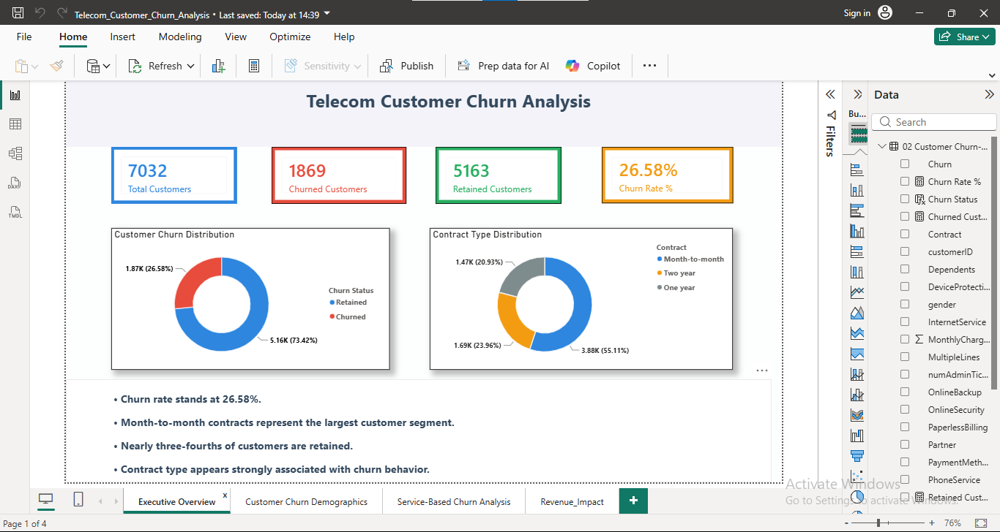
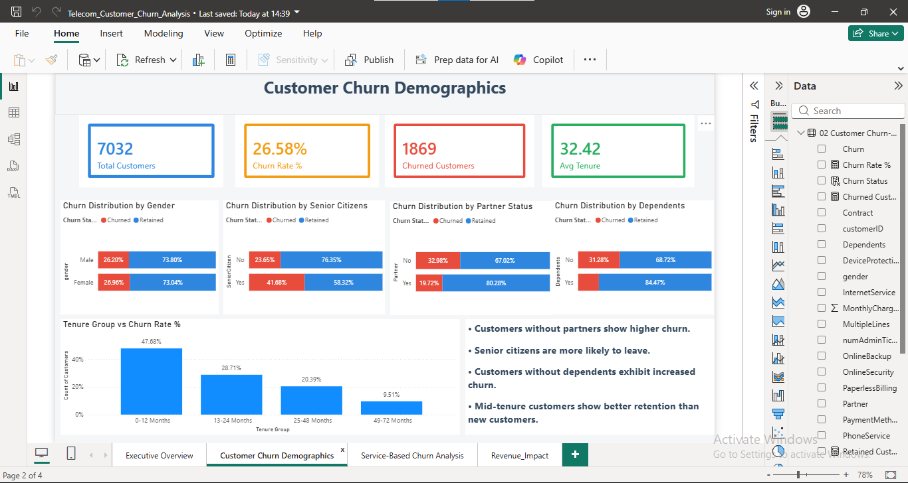
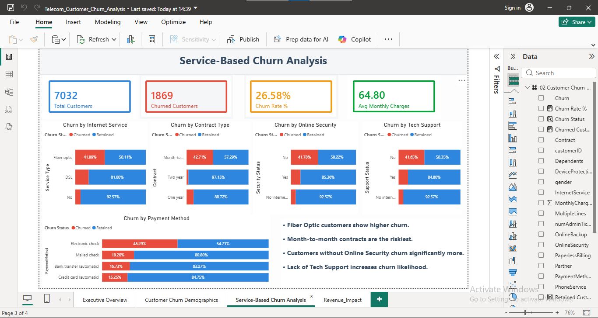
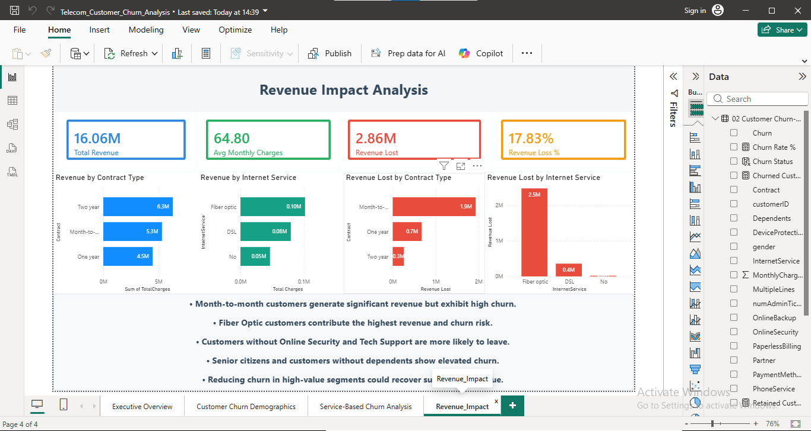

# Telecom Customer Churn Analysis

A Power BI dashboard and SQL-based analysis of customer churn for a telecom provider, covering churn drivers, customer demographics, service-based patterns, and revenue impact.

## Project Overview

This project analyzes ~7,000 telecom customer records to identify which customer segments, services, and contract types are most associated with churn, and to quantify the revenue at risk. The workflow goes from raw CSV data → SQL validation and analysis queries → a four-page interactive Power BI dashboard.

**Headline numbers:**
- **7,032** total customers analyzed (11 records with missing `TotalCharges` were excluded — see [Data Notes](#data-notes))
- **26.58%** overall churn rate (1,869 churned / 5,163 retained)
- **$16.06M** total historical revenue, of which **$2.86M (17.83%)** is associated with churned customers

## Repository Structure

- `Telecom_Customer_Churn_Analysis.pbix` — Power BI dashboard (source file)
- `Telecom Customer churn dataset.csv` — Raw dataset
- `sql/`
  - `01_DATA_VALIDATION.sql` — Row counts, duplicates, nulls, range checks
  - `02 - CUSTOMER_CHURN _ANALYSIS.sql` — Overall churn, churn by contract/tenure/demographics
  - `03 - CUSTOMER SEGMENT ANALYSIS.sql` — Churn by service type, security, support, payment method
  - `04 - REVENUE IMPACT ANALYSIS.sql` — Total/churned revenue by contract and service type
- `screenshots/`
  - `01_Executive_Overview.png`
  - `02_Customer_Demograpics.png`
  - `03_Service_Based_Churn.png`
  - `04_Revenue_Impact.png`

All SQL scripts run against a table named `Telecom_customer_churn`, created in `01_DATA_VALIDATION.sql`.

## Dataset

Based on the widely-used IBM Telco Customer Churn dataset, with one added field:

| Column | Description |
|---|---|
| `customerID` | Unique customer identifier |
| `gender`, `SeniorCitizen`, `Partner`, `Dependents` | Demographic attributes |
| `tenure` | Months the customer has stayed with the company |
| `PhoneService`, `MultipleLines`, `InternetService` | Core service subscriptions |
| `OnlineSecurity`, `OnlineBackup`, `DeviceProtection`, `TechSupport`, `StreamingTV`, `StreamingMovies` | Add-on services |
| `Contract`, `PaperlessBilling`, `PaymentMethod` | Billing details |
| `MonthlyCharges`, `TotalCharges` | Revenue fields |
| `numAdminTickets` | Number of administrative support tickets raised by the customer (added field, not part of the original dataset) |
| `Churn` | Whether the customer left within the last month (Yes/No) — target variable |

## Data Notes

- 11 records had blank `TotalCharges` values (all with `tenure = 0`, i.e. brand-new customers with no billing history yet). These were excluded from the dashboard and revenue calculations, reducing the analyzed base from 7,043 to 7,032 customers.
- SQL queries use `TRY_CAST(NULLIF(LTRIM(RTRIM(TotalCharges)), '') AS DECIMAL(18,2)) IS NOT NULL` as the standard filter to enforce this exclusion consistently.

## SQL Analysis

**01 – Data Validation**
Confirms row counts, checks for duplicate `customerID`s, identifies missing `TotalCharges` values, verifies `Churn` categories, and sanity-checks numeric ranges for `tenure` and `MonthlyCharges`.

**02 – Customer Churn Analysis**
Calculates overall churn rate, and breaks churn down by contract type, tenure group (0–12 / 13–24 / 25–48 / 49–72 months), and demographic combinations (gender, senior citizen, partner, dependents).

**03 – Customer Segment Analysis**
Breaks churn down by internet service type, online security, tech support, payment method, and number of admin tickets raised.

**04 – Revenue Impact Analysis**
Quantifies total and churned revenue, average monthly charges, and revenue breakdowns by contract type and internet service, including revenue specifically tied to churned customers.

## Dashboard

Four pages, built in Power BI:

1. **Executive Overview** — headline KPIs, churn distribution, contract type distribution
2. **Customer Churn Demographics** — churn by gender, senior citizen status, partner/dependent status, and tenure group
3. **Service-Based Churn Analysis** — churn by internet service, contract, online security, tech support, and payment method
4. **Revenue Impact Analysis** — total and lost revenue by contract type and internet service

### Key Findings

- **Contract type is the strongest churn signal.** Month-to-month customers churn far more than one- or two-year contract holders.
- **Fiber optic customers churn more than DSL customers**, despite generating the most revenue — making them the highest-value, highest-risk segment.
- **Customers without Online Security or Tech Support churn at a significantly higher rate** than those with these add-ons.
- **New customers (0–12 months tenure) account for the largest share of churn** (47.68% of churned customers fall in this tenure band); churn drops sharply as tenure increases.
- **Customers without partners, without dependents, or who are senior citizens** all show elevated churn rates relative to their counterparts.
- Month-to-month, fiber optic customers represent the single largest concentration of at-risk revenue ($1.9M of the $2.86M in churned revenue is tied to month-to-month contracts).

## 📸 Dashboard Preview

### Executive Overview

### Customer Churn Demographics

### Service-Based Churn Analysis

### Revenue Impact Analysis

## Tools Used

- **SQL** — data validation and exploratory analysis
- **Power BI** — data modeling, DAX measures, dashboard visualization

## How to Use

1. Load `Telecom Customer churn dataset.csv` into a SQL database, creating a table named `Telecom_customer_churn`.
2. Run the scripts in `sql/` in order (01 → 04) to reproduce the validation and analysis queries.
3. Open `Telecom_Customer_Churn_Analysis.pbix` in Power BI Desktop to explore the interactive dashboard.
